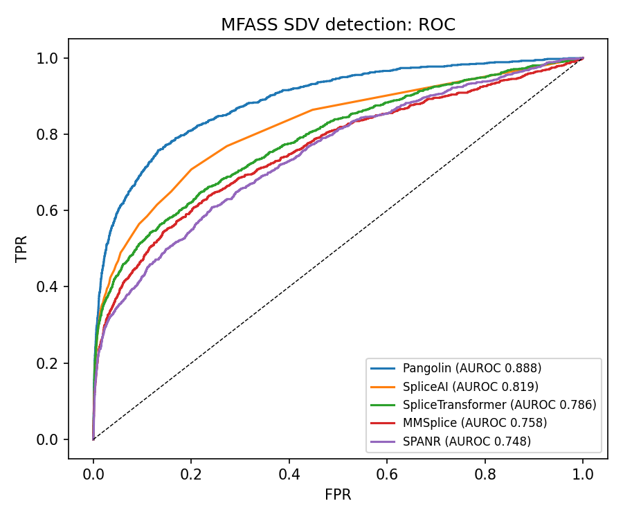
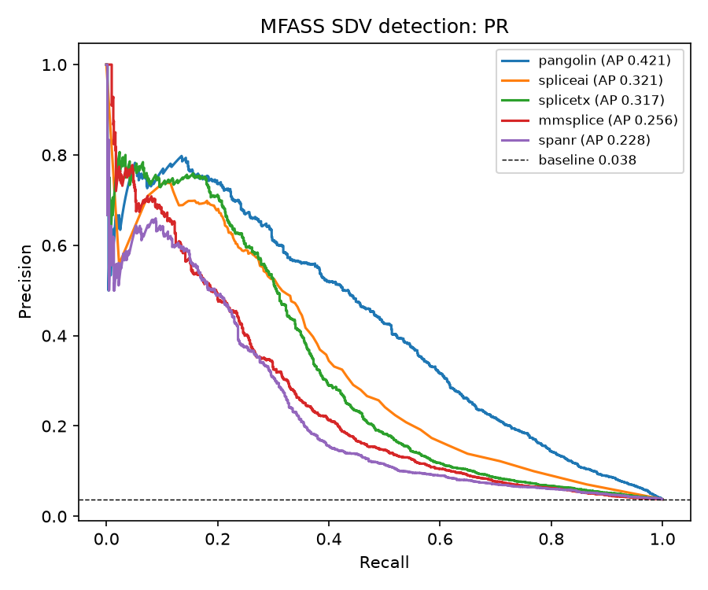
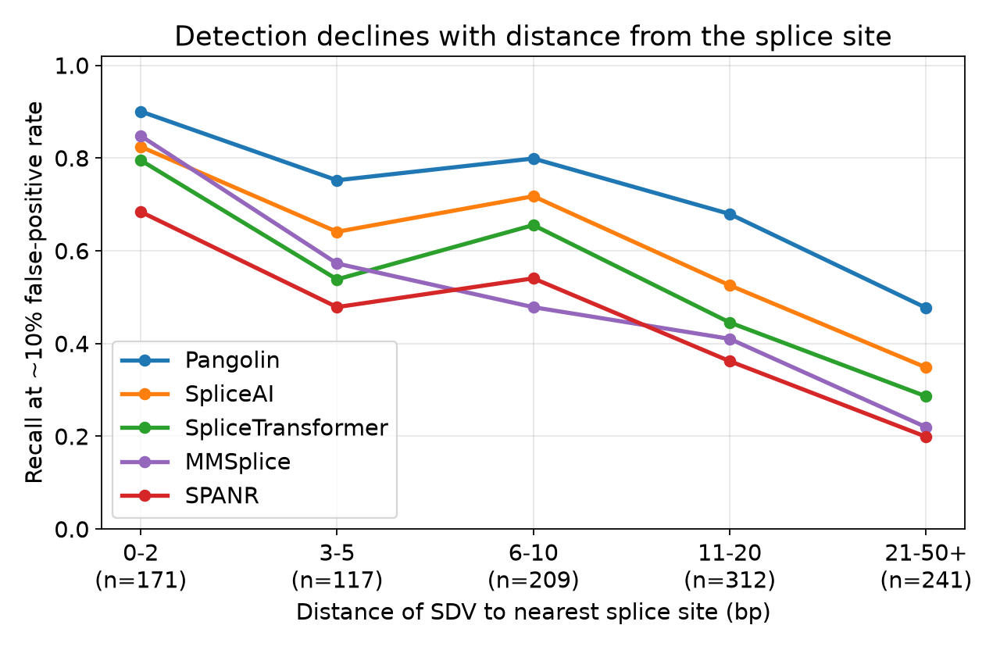

# SpliceConsensus: benchmarking splicing variant-effect predictors against a multiplexed splicing assay

**Brhanu F. Znabu, Zohaib Atif, Pradeep Devkota, Rediet Habtu Alemu, Jackfin K. C.**

[](https://doi.org/10.5281/zenodo.20948820)


A leakage-aware, head-to-head benchmark of four modern published splicing variant-effect
predictors (SpliceAI, Pangolin, and SpliceTransformer run through the
[Proto](https://proto.evodesign.org) tool ecosystem; MMSplice scored from a
cassette-exon reconstruction), together with the older SPANR model as a legacy baseline,
evaluated against experimental data (the MFASS multiplexed splicing assay).
Every number is computed against fixed experimental ground truth and is reproducible
from the committed scores and labels with one command.

## Headline

On **27,733** single-nucleotide variants in and around human exons with measured
exon-inclusion outcomes (1,050 splice-disrupting, 3.79%):

| predictor | AUROC | AP (AUPRC) | AP 95% CI |
|---|---:|---:|---|
| **Pangolin** | **0.888** | **0.421** | [0.386, 0.454] |
| SpliceAI | 0.819 | 0.321 | [0.293, 0.353] |
| SpliceTransformer | 0.786 | 0.317 | [0.285, 0.352] |
| MMSplice | 0.758 | 0.256 | [0.226, 0.285] |
| SPANR (legacy) | 0.748 | 0.228 | [0.202, 0.260] |

- **Pangolin is the strongest predictor**, by a clear margin (its AP confidence interval does not overlap the others).
- **All four modern tools beat the legacy SPANR** model; MMSplice ranks fourth, just above SPANR (used here tissue-agnostically on a single-cassette minigene context rather than a variant's native transcript).
- The ranking **reproduces the ordering reported by the Pangolin authors**, a correctness check on the pipeline.
- A calibrated **consensus** of the three deep-learning sequence-window tools, evaluated on an exon-grouped held-out split, **does not meaningfully improve over Pangolin alone** (held-out AP 0.443 vs 0.442; the model essentially relies on Pangolin). For this MFASS benchmark, Pangolin is the strongest single predictor.
- **All five tools share a blind spot.** Recall of disrupting variants declines with distance from the splice site, and **19% of disrupting variants (200/1,050) are missed by every tool**, 74% of them exonic and 77% more than 10 bp from a splice site. MMSplice, the one model built for modular exonic and intronic effects rather than splice-site recognition, shows the same decline, so the blind spot is a shared limitation of current predictors on this assay rather than an artifact of splice-site-centric design. These misses are consistent with exon-interior regulatory disruptions (possible exonic enhancer or silencer effects).




## Where the tools fail

Stratifying splice-disrupting-variant recall by distance to the nearest splice site
(at a common 10% false-positive rate) shows that every tool detects splice-site-proximal
disruptions well but degrades away from the splice site. Within 2 bp, the modern tools
recover 80 to 90% of disrupting variants (Pangolin 0.90, SpliceAI 0.82, SpliceTransformer
0.80, MMSplice 0.85); beyond 20 bp, recall falls to 0.48 / 0.35 / 0.29 / 0.22
(Pangolin / SpliceAI / SpliceTransformer / MMSplice) and 0.20 for SPANR. More than half of
disrupting variants lie more than 10 bp from a splice site, and even Pangolin detects only
59% of them. The practical message: trust these tools near splice sites, use caution in the
exon interior, where roughly one in five disrupting variants (200/1,050, 74% exonic) is
invisible to all five predictors (`src/failure_mode.py`). Distance is computed from the
MFASS construct and cross-checked against genomic coordinates (r=0.997).



## What this is, and what it is not

This is a benchmark anchored to experimental measurement, not a generative design
that would need separate validation. It shows which predictor to trust on this
assay; it does not claim clinical validation. Caveats: the predictors were trained
on genomic/transcriptomic data and may have seen these exons' wild-type splice sites
during training (a realistic benchmark, not a fully held-out one, and the same for
all tools); MFASS is a single-context in-vitro minigene assay (tissue-aware tools
are used tissue-agnostically); and all tools are scored as disruption magnitudes
against a loss-of-function label.

## Data

[MFASS](https://github.com/KosuriLab/MFASS) (Chong et al. 2019) measured the
splicing effect of ~28,972 human single-nucleotide variants in exons and their
flanking intronic regions (51% exonic, 49% near-splice-site intronic) in a minigene reporter. We use the
public processed table (hg38 coordinates, ref/alt alleles, the continuous
exon-inclusion change, and the splice-disrupting-variant label). The slim file
`data/mfass_labels.csv` (id, label, delta-PSI, SPANR score) is committed so the
benchmark reproduces without the full dataset.

## Method

1. **Score** each variant with each predictor in its real hg38 context
   (`src/score_one_tool.py`, GPU; needs the Proto tool stack + hg38 + pyfaidx).
   Per-tool delta scores: SpliceAI max delta; Pangolin max gain/loss magnitude;
   SpliceTransformer max acceptor/donor probability change (reference vs alternate);
   SPANR uses its precomputed max-tissue delta magnitude. MMSplice is scored separately
   from a VCF plus a cassette-exon GTF that places each MFASS exon as an internal exon of
   a three-exon transcript, so both of its splice modules fire; the per-variant score is
   the magnitude of the change in the modular logit-Psi (`mmsplice_bundle/`).
2. **Benchmark** against the experimental label (`src/analyze.py`, CPU): per-tool
   AUROC and average precision with 1,000-sample bootstrap CIs, a Spearman check
   against the continuous readout, an exon-grouped held-out consensus (three
   deep-learning tools), and figures.

Minus-strand alleles are normalized to the plus strand before scoring; for the
three Proto-scored sequence-window predictors and MMSplice, full coverage (28,972 of
28,972) confirms no variant is silently dropped (SPANR covers slightly fewer, a
precomputed subset). SpliceAI returns no score for variants outside an annotated gene;
these are assigned 0 (a minority, shown by the depletion of disrupting variants among
zero-scored variants).

## Reproduce

```bash
# the benchmark + figures, from the committed scores and labels (CPU, ~1 min)
pip install -r requirements.txt
python src/analyze.py
# -> results/benchmark_table.csv, benchmark_summary.json, fig_roc.png, fig_pr.png
```

To regenerate the scores from scratch you additionally need hg38, the full MFASS
table, and the Proto tool stack (proto-tools + proto-language), then run
`src/score_one_tool.py --tool {spliceai,pangolin,splicetx}` (GPU; supports
`--nshards/--shard` for Slurm arrays).

## References

- Zeng & Li. Predicting RNA splicing from DNA sequence using Pangolin. *Genome Biology* 23:103, 2022. doi:10.1186/s13059-022-02664-4.
- Jaganathan et al. Predicting splicing from primary sequence with deep learning (SpliceAI). *Cell* 176(3):535–548.e24, 2019. doi:10.1016/j.cell.2018.12.015.
- You et al. SpliceTransformer predicts tissue-specific splicing linked to human diseases. *Nature Communications*, 2024. doi:10.1038/s41467-024-53088-6.
- Cheng et al. MMSplice: modular modeling improves the predictions of genetic variant effects on splicing. *Genome Biology* 20:48, 2019. doi:10.1186/s13059-019-1653-z.
- Chong, R., Insigne, K.D., Yao, D., et al. A multiplexed assay for exon recognition reveals that an unappreciated fraction of rare genetic variants cause large-effect splicing disruptions (MFASS). *Molecular Cell* 73:183–194.e8, 2019. doi:10.1016/j.molcel.2018.10.037.
- Xiong et al. RNA splicing. The human splicing code reveals new insights into the genetic determinants of disease (SPANR). *Science* 347(6218):1254806, 2015. doi:10.1126/science.1254806.
- Smith & Kitzman. Benchmarking splice variant prediction algorithms using massively parallel splicing assays. *Genome Biology* 24:294, 2023. doi:10.1186/s13059-023-03144-z.
- Rentzsch et al. CADD-Splice—improving genome-wide variant effect prediction using deep learning-derived splice scores. *Genome Medicine* 13:31, 2021. doi:10.1186/s13073-021-00835-9.
- Merchant et al. A high-level programming language for generative biology with Proto. *bioRxiv* 2026.06.22.733870, 2026. doi:10.64898/2026.06.22.733870.
